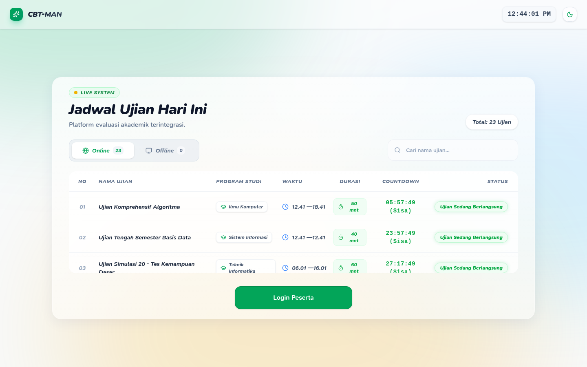
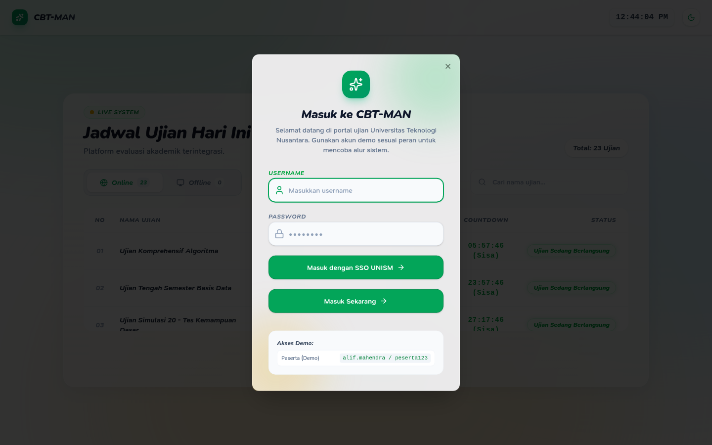
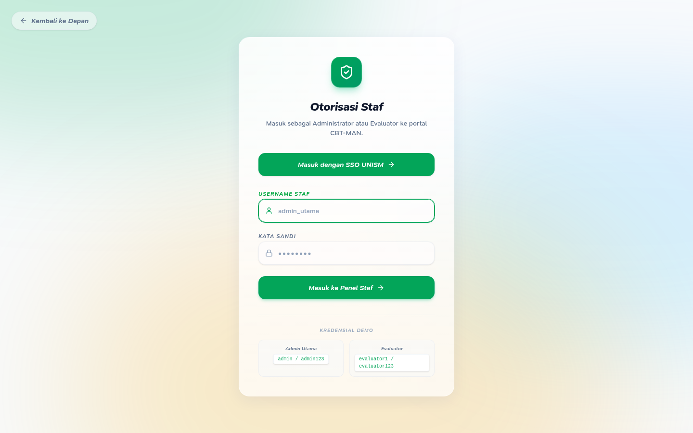
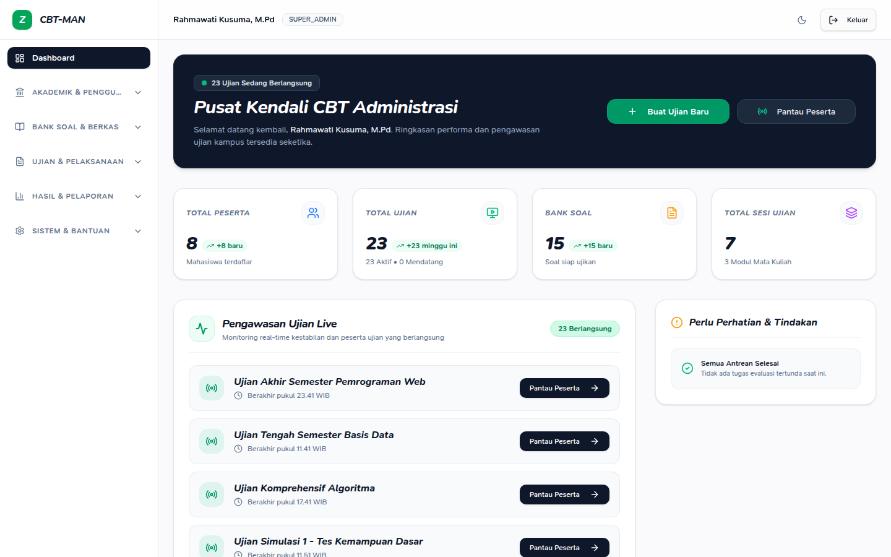
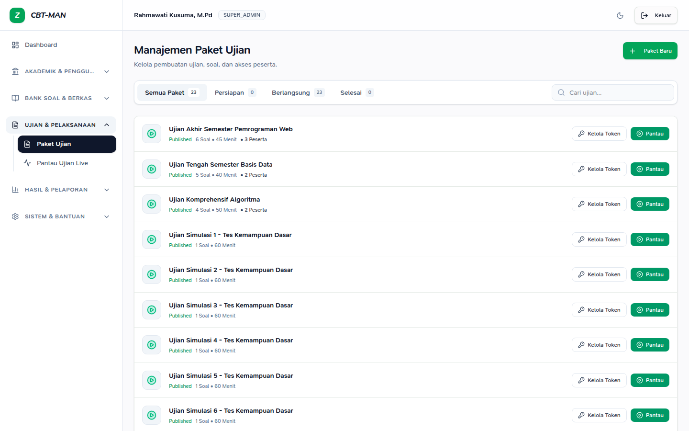
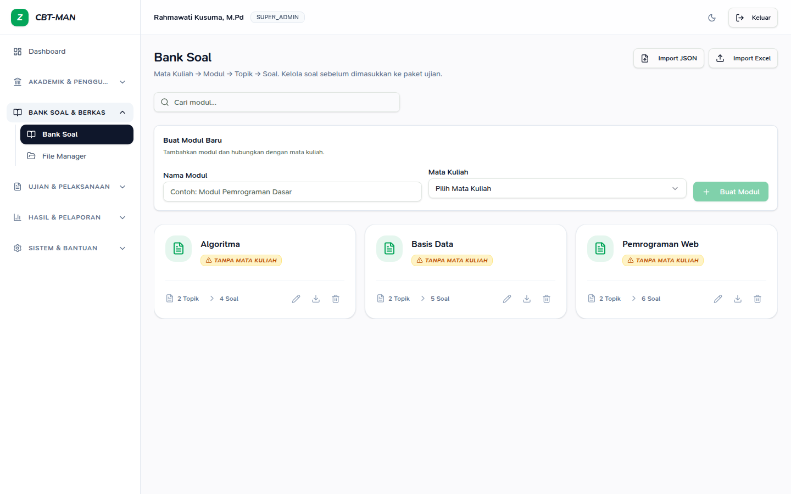
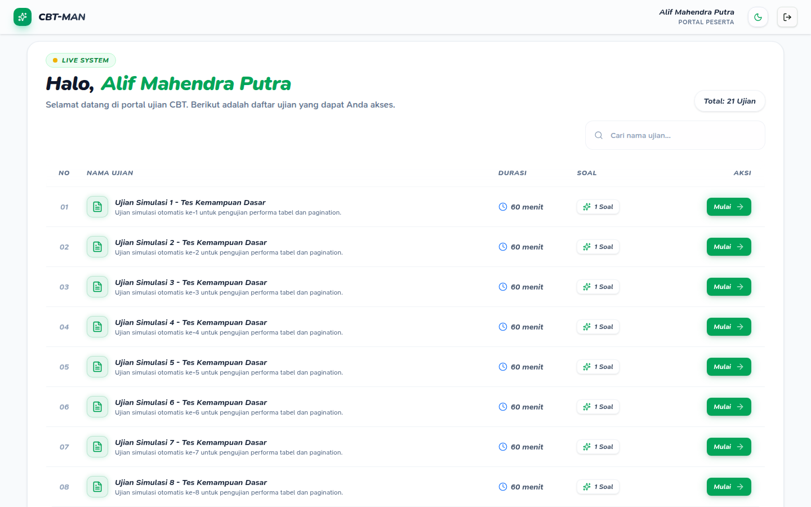

# CBT-MAN


**CBT-MAN** adalah aplikasi **Computer-Based Test (CBT)** untuk dunia pendidikan, dibangun dengan **TanStack Start, React, TypeScript, Prisma, dan SQLite**.

> Didedikasikan untuk pendidikan. Open source under lisensi MIT.

## Tampilan

Cuplikan dari data demo lokal. Gambar memakai tautan relatif sesuai [sintaks gambar GitHub](https://docs.github.com/en/get-started/writing-on-github/getting-started-with-writing-and-formatting-on-github/basic-writing-and-formatting-syntax#images).

| Landing | Login peserta |
| --- | --- |
|  |  |
| **Login staf** | **Dasbor admin** |
|  |  |
| **Paket ujian** | **Bank soal** |
|  |  |



---

## Kapabilitas

- Bank soal terstruktur: `Modul → Topik → Soal`
- Tipe soal: pilihan ganda, ganda benar, benar/salah, essay
- Konfigurasi ujian: durasi, penilaian, token, grup peserta, pengacakan, mode fullscreen, deteksi pindah tab
- Sesi peserta dengan status: belum mulai, berlangsung, selesai, kadaluarsa
- Penilaian essay manual untuk admin/operator
- Hasil, evaluasi, laporan, peringkat, dan monitoring peserta
- Persistensi SQLite via Prisma

## Teknologi

**Frontend:** TanStack Start, React 19, TypeScript, Tailwind CSS 4, Radix UI, Zustand
**Backend & DB:** Prisma, SQLite, TanStack server functions
**Tooling:** Vite, ESLint, Prettier, Node test runner

## Memulai

```bash
npm install
npm run prisma:migrate    # jalankan migrasi
npm run prisma:seed       # isi data demo
npm run dev               # mode pengembangan
```

### Verifikasi

```bash
npm run lint
npm run typecheck
npm run test:unit
npm run build
```

## Akun Demo

> Akun berikut hanya untuk development/demo. Pada production dengan database kosong, set
> `ADMIN_PASSWORD` sebelum aplikasi dimulai; proses seed akan berhenti bila nilainya kosong.

| Peran | Username | Password |
|-------|----------|----------|
| Admin | `admin` | `admin123` |
| Operator | `operator1` | `operator123` |
| Guru | `guru_mtk` | `guru123` |
| Peserta | `alif.mahendra` | `peserta123` |

> Lihat `src/lib/server/db/seed-shared.mjs` untuk daftar lengkap.

## Struktur Proyek

```
prisma/              Skema & seeder database
src/components/      Komponen UI
src/lib/cbt/         Tipe, repo, auth, logika ujian
src/lib/server/      Server functions, DB, seed
src/routes/          Rute berbasis file (TanStack Start)
```

## Lisensi

Lisensi **MIT** — bebas digunakan, dimodifikasi, dan didistribusikan, termasuk untuk keperluan komersial, asal menyertakan notice lisensi.

Lihat [`LICENSE`](./LICENSE) untuk teks lengkap.

## Kontribusi

Baca [`CONTRIBUTING.md`](./CONTRIBUTING.md). Kontribusi yang meningkatkan kualitas dan keamanan dipersilakan.
